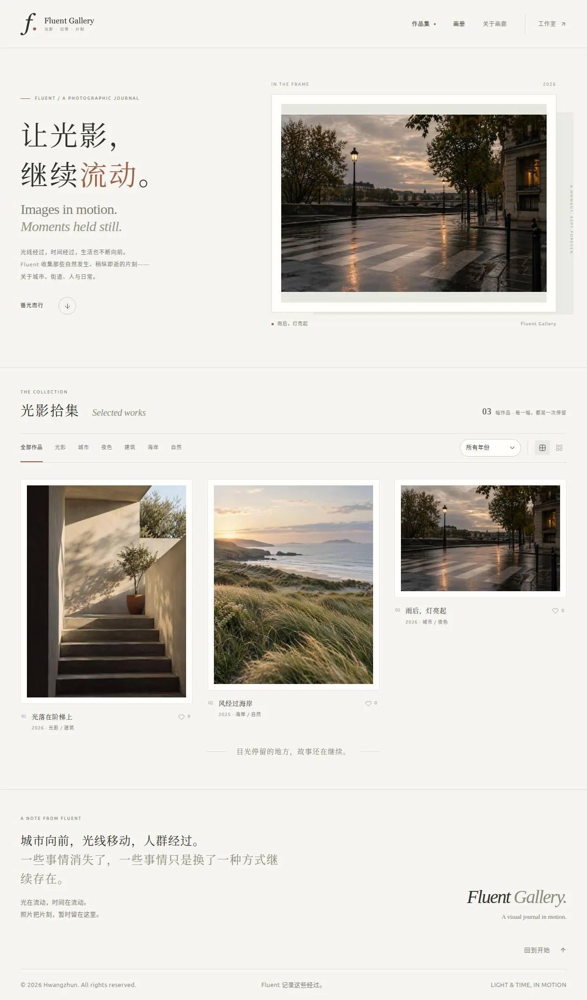
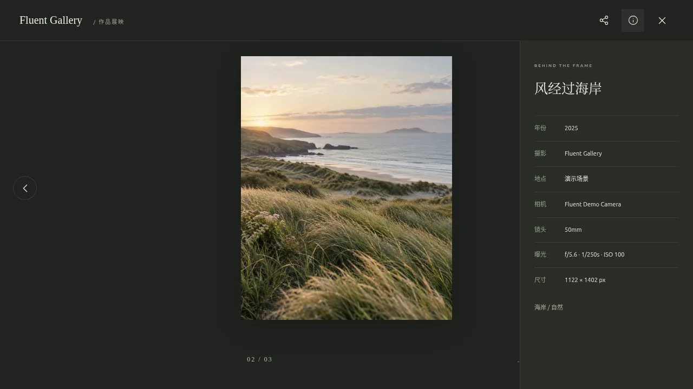
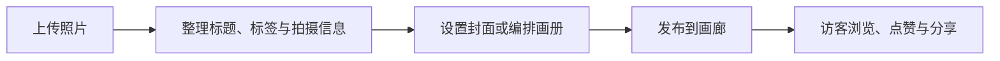
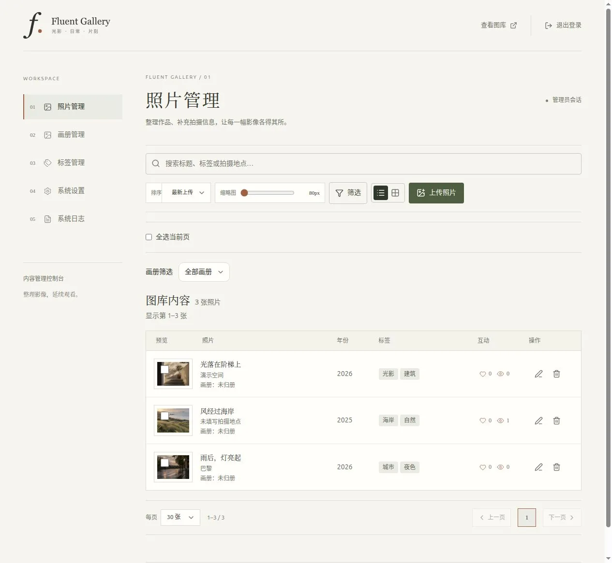

<p align="center">
  
</p>

<h3 align="center">让光影，继续流动。</h3>

<p align="center">
  一座安静、自然、属于摄影者自己的线上画廊。<br />
  用作品集陈列片刻，用画册讲述完整的故事。
</p>

> Fluent Gallery 是一个可自行部署的摄影作品展示与管理工具。它更像一本可以慢慢翻阅的摄影书，而不是堆满按钮的网盘或后台系统。



_截图中的摄影作品为非个人演示内容。_

## Fluent Gallery 是什么

照片不只是一张文件，也可以是一段时间、一处光线，或一次值得停留的观看。

Fluent Gallery 希望为这些照片留出足够的空间。访客打开画廊时，首先看到的是一幅封面作品和一段简短的引导；继续向下，作品以疏朗的瀑布流展开。摄影者则可以在独立的“工作室”里上传照片、整理标签、编排画册，并决定画廊最终呈现的节奏。

它适合：

- 希望拥有个人摄影主页的摄影爱好者；
- 想按主题、年份或系列整理长期作品的人；
- 在意图片归属，希望自行保管照片和数据的用户；
- 喜欢简洁、克制、摄影书式浏览体验的人。

## 你可以用它做什么

| 体验 | 说明 |
| --- | --- |
| 浏览作品集 | 响应式瀑布流会适应电脑和手机，也可切换舒展或紧凑布局。 |
| 寻找照片 | 按主题标签或拍摄年份筛选，快速回到某一段时间或一个系列。 |
| 沉浸观看 | 点击作品进入大图模式，支持方向键、按钮和手机滑动切换。 |
| 了解画面 | 展示标题、描述、作者、地点、相机、镜头和曝光信息。 |
| 表达与分享 | 访客可以点赞、查看浏览量，并通过系统分享或复制链接。 |
| 阅读画册 | 将一组照片按指定顺序编成画册，设置封面、简介与发布状态。 |
| 管理收藏 | 批量上传、搜索、筛选、修改标签与拍摄信息，并查看互动数据。 |



## 快速开始

最省心的方式是使用 Docker。请先安装 [Docker](https://docs.docker.com/get-docker/) 与 Docker Compose，然后执行：

```bash
git clone https://github.com/hwangzhun/fluent-gallery.git
cd fluent-gallery
docker compose up -d --build
```

启动后访问：

- 画廊：<http://localhost:3000>
- 工作室：<http://localhost:3000/#/admin>

首次登录密码为 `admin123`。进入工作室后，请立即前往“系统设置 → 安全”修改密码。

> Docker 默认只监听本机地址。如果要让画廊通过公网域名访问，请在它前面配置反向代理与 HTTPS。

当前版本为 **1.0.6**。如果希望在本地开发或参与项目，需要 Node.js 20.6+；相关配置可参考 [`.env.example`](./.env.example)。

## 第一次使用

1. 打开 `/#/admin` 进入工作室，先修改默认管理员密码。
2. 在“照片管理”中上传一张或一批照片。系统会读取可用的 EXIF 信息，并生成适合网页浏览的展示图与缩略图。
3. 为照片补充标题、描述、年份和标签；需要时也可以修改作者、地点、相机与曝光信息。
4. 在“系统设置 → 常规”中选择首页封面作品，调整画面比例、位置和缩放。
5. 在“画册管理”中新建画册、选片、排列顺序并指定封面，准备好后再发布到前台。
6. 回到公开画廊检查最终效果，然后把画廊或单幅作品链接分享给朋友。





## 让画廊更像你

- **首页封面**：选择一幅或多幅 Hero 作品，并分别调整裁切、比例、位置和缩放。
- **展示节奏**：首页作品可以按时间排列，也可以在每次访问时随机展开；筛选结果仍保持稳定顺序。
- **作者与版权**：为新上传的照片预设作者和版权信息，仍可逐张修改。
- **AI 辅助整理**：连接兼容 OpenAI 格式的视觉接口后，可为照片生成中文标题与标签；这项能力完全可选。
- **被发现与被理解**：可配置 SEO 信息，也可以选择接入 Google Analytics 4 了解公开画廊的访问情况。
- **照片放在哪里**：默认保存在本机，也支持阿里云 OSS 和腾讯云 COS；存储密钥只由服务端保存。

工作室还提供照片搜索、年份与标签筛选、列表/网格视图、批量修改、批量归册、画册排序、标签管理和运行日志。日常整理不需要接触数据库或配置文件。

## 数据与备份

使用默认 Docker 配置时，重建或更新容器不会清空画廊内容：

| 目录 | 保存内容 |
| --- | --- |
| `data/` | SQLite 数据库，包括照片信息、标签、画册和设置。 |
| `uploads/` | 使用本地存储时的展示图与缩略图。 |
| `logs/` | 运行日志，便于排查问题。 |

备份前建议先暂停服务，复制数据库和本地照片后再启动：

```bash
docker compose stop gallery
mkdir -p backups/$(date +%Y%m%d)
cp -a data uploads backups/$(date +%Y%m%d)/
docker compose start gallery
```

如果照片保存在 OSS 或 COS，还应根据对应服务商的方式备份 Bucket。恢复时请先停止服务，再还原同一份数据库与照片文件，避免记录和图片不一致。

## 它如何工作

Fluent Gallery 把公开画廊、工作室和 API 放在同一个服务中。SQLite 保存照片信息、标签、画册与设置；图片可以保存在服务器本地，也可以放在 OSS 或 COS。上传时系统会准备较轻的展示图与缩略图，让访客浏览更顺畅，同时避免把管理入口暴露给普通访客。

想进一步了解内部结构，可以查看：

- [服务端与 API 概览](./server/README.md)
- [数据库结构说明](./database/README.md)

---

<p align="center">
  <em>Images in motion. Moments held still.</em>
</p>
